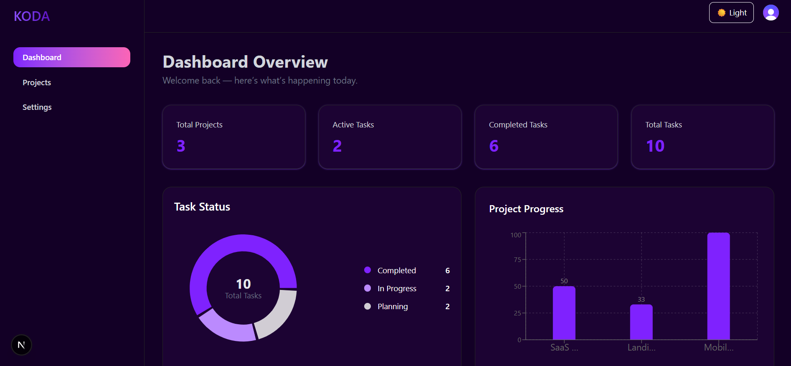
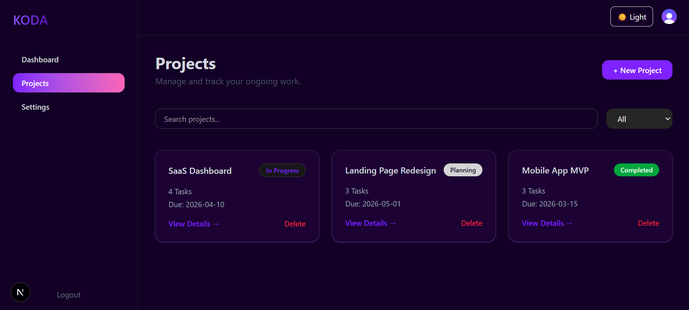
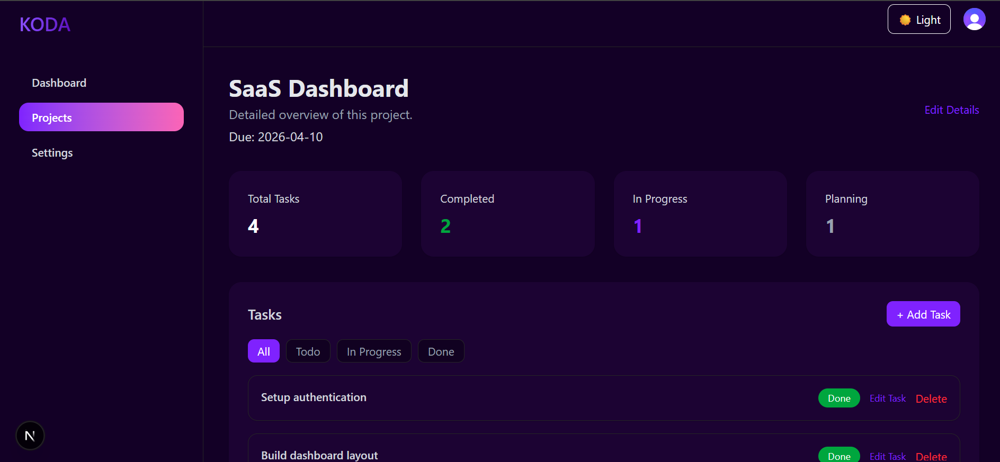

# KODA – Project Management Dashboard

A modern project management dashboard to create projects, manage tasks, and track progress with analytics. Built with a clean SaaS-style UI, authentication, and responsive design.

## 🚀 Live Demo

https://your-live-link.vercel.app

## ✨ Features

* Create, edit, and delete projects
* Add, edit, delete tasks
* Task status workflow (Todo → In Progress → Done)
* Dashboard analytics with charts
* Dark / Light theme
* Mobile responsive layout with sliding sidebar
* Persistent state using local storage
* Secure authentication

## 🛠 Tech Stack

* Next.js
* TypeScript
* Tailwind CSS
* Zustand
* Clerk Authentication
* Recharts

## 📦 Installation

Clone the repo

```bash
git clone https://github.com/SouravDaroch/koda-dashboard.git
cd koda-dashboard
```

Install dependencies

```bash
npm install
```

Run development server

```bash
npm run dev
```

## 🔐 Environment Variables

Create `.env.local`:

```
NEXT_PUBLIC_CLERK_PUBLISHABLE_KEY=your_key
CLERK_SECRET_KEY=your_key
```

## Screenshots





## 👨‍💻 Author

Built by **Sourav Daroch**
