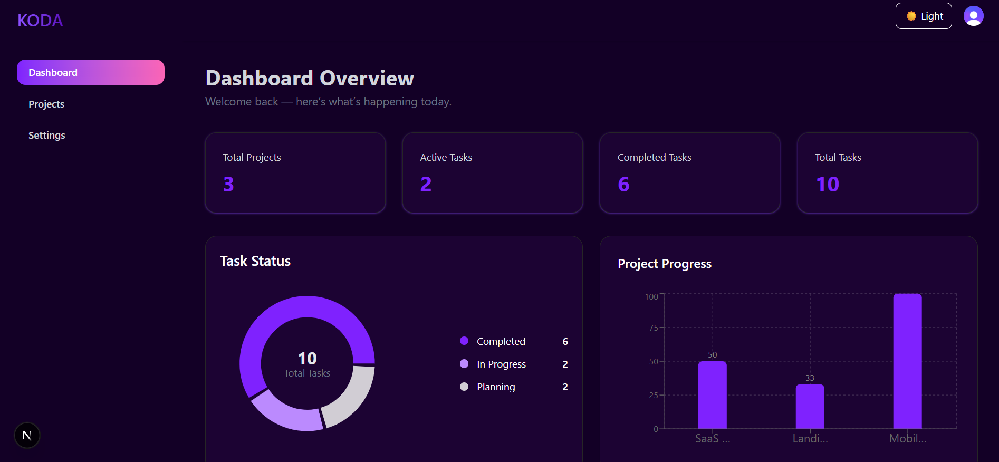
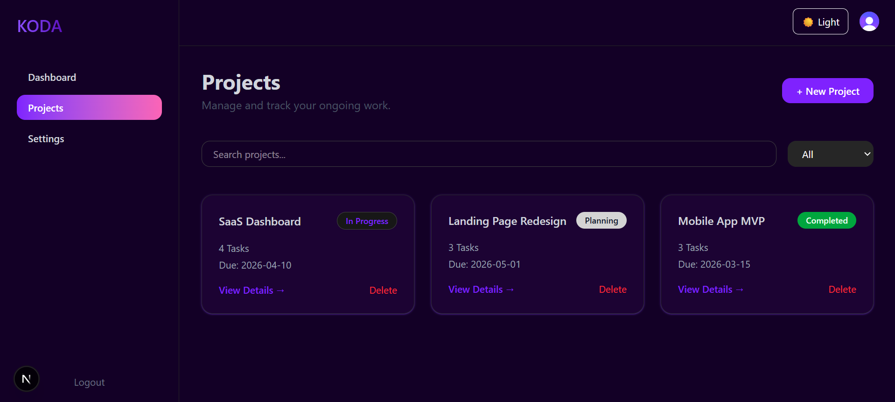
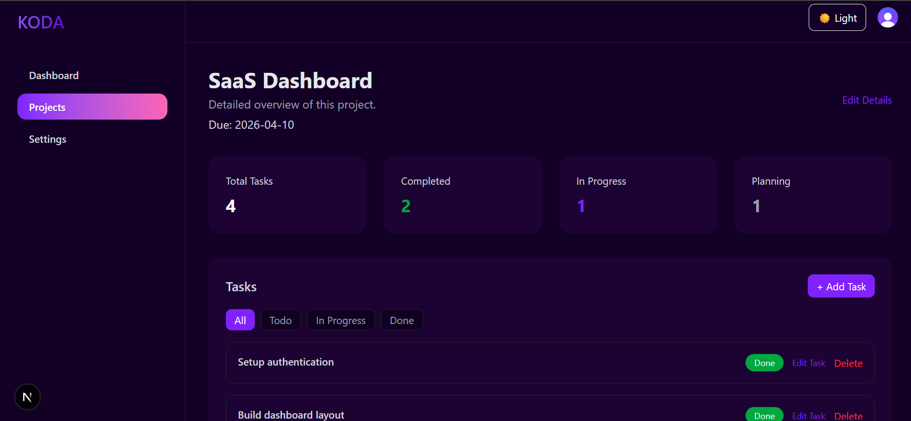

# KODA – Project Management Dashboard

A modern project management dashboard to create projects, manage tasks, and track progress with analytics. Built with a clean SaaS-style UI, authentication, and responsive design.

## 🚀 Live Demo

https://koda-dashboard-nine.vercel.app/

## ✨ Features

* Create, edit, and delete projects
* Add, edit, delete tasks
* Task status workflow (Todo → In Progress → Done)
* Dashboard analytics with charts
* Dark / Light theme
* Mobile responsive layout with sliding sidebar
* Persistent data securely stored in a Postgres database
* Secure authentication & user management

## 🛠 Tech Stack

### 🎨 Frontend
* **Framework:** Next.js
* **Language:** TypeScript
* **Styling:** Tailwind CSS, Framer Motion
* **State Management:** Zustand
* **Charts:** Recharts

### ⚙️ Backend & Infrastructure
* **Database:** Neon Serverless Postgres (PostgreSQL)
* **ORM:** Prisma
* **Authentication:** Clerk

## 📦 Installation

Clone the repo

```bash
git clone https://github.com/SouravDaroch/koda-dashboard.git
cd koda-dashboard
```

Install dependencies

```bash
npm install
```

Set up Prisma ORM & Database

```bash
npx prisma generate
npx prisma db push
```

Run development server

```bash
npm run dev
```

## 🔐 Environment Variables

Create `.env.local`:

```env
NEXT_PUBLIC_CLERK_PUBLISHABLE_KEY=your_clerk_publishable_key
CLERK_SECRET_KEY=your_clerk_secret_key
```

Create `.env`:

```env
DATABASE_URL=your_neon_postgres_connection_string
```

## Screenshots





## 👨‍💻 Author

Built by **Sourav Daroch**
